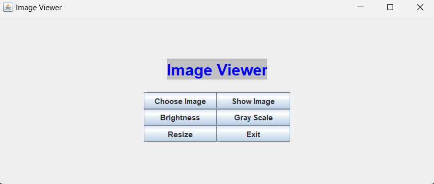

# JavaImageViewer

JavaImageViewer is a Java-based graphical user interface (GUI) application that allows users to perform various operations on images, such as viewing, resizing, converting to grayscale, and adjusting brightness.

## Features

- **View Images**: Open and display images from your file system.
- **Resize Images**: Change the dimensions of your images.
- **Grayscale Conversion**: Convert images to grayscale.
- **Adjust Brightness**: Modify the brightness of your images.

## Getting Started

### Prerequisites

- Java Development Kit (JDK) 8 or higher

### Running the Application

1. **Clone the repository:**

    ```sh
    git clone https://github.com/ykazemim/JavaImageViewer.git
    cd JavaImageViewer
    ```

2. **Compile and run the application:**

    ```sh
    javac Main.java
    java Main
    ```

## Usage

- **Choose Image**: Click on "Choose Image" to select an image file from your computer.
- **Show Image**: Click on "Show Image" to display the selected image.
- **Resize**: Click on "Resize" to enter the resize section, input the desired width and height, and then click "Show Result" to display the resized image.
- **Gray Scale**: Click on "Gray Scale" to convert the selected image to grayscale.
- **Brightness**: Click on "Brightness" to enter the brightness adjustment section, input the brightness factor (between 0 and 1), and then click "Result" to display the brightness-adjusted image.
- **Exit**: Click on "Exit" to close the application.

## Screenshots



## Acknowledgments

Some parts of this code were inspired by solutions from [stackoverflow.com](https://stackoverflow.com).

## Assignment

It was originally created as an assignment for the Advanced Programming course at Amirkabir University of Technology (AUT).
